lecture: 
Software Architecture
---
title: 
Seismo Scraping
---
author:
Christelle Rossier
---
 
# Getting started

You will use [Markdown](https://www.markdownguide.org/cheat-sheetplan), [PlantUML](https://plantuml.com/), [architectural decision records](https://github.com/adr/madr), feature models and connector views to describe a software architecture model about your own project.

This document will grow during the semester as you sketch and refine your software architecture model.

When you are done with each task, please push so we can give you feedback about your work.

We begin by selecting a suitable project domain.


# Ex - Domain Selection 

{.instructions

Submit the name and brief description (about 100 words) of your domain using the following vision statement template:

```
For [target customers]
Who [need/opportunity/problem]
The [name your project]
Is  [type of project]
That [major features, core benefits, compelling reason to buy]
Unlike [current reality or competitors]
Our Project [summarize main advantages over status quo, unique selling point]
```

Please indicate if your choice is:

* a project you have worked on in the past (by yourself or with a team)
* a project you are going to work on this semester in another lecture (which one?)
* a new project you plan to build in the future
* some existing open source project you are interested to contribute to

The chosen domain should be unique for each student.

Please be ready to give a 2 minute presentation about it (you can use one slide but it's not necessary)

Hint: to choose a meaningful project look at the rest of the modeling tasks which you are going to perform in the context of your domain.

}

Project Name: *Seismo Scraping*

Project Type: Bachelor thesis project I worked on alone last year, which is also a project that is to be continued now with a team

Context/Additional Information: The FSVO is responsible to promote the health and well-being of humans and animals. Among many other tasks, FSVO produces a monthly newsletter called Seismo Info, containing a list of articles presenting some interesting and important information on food safety.
Link to get the Seismo Info of January 2023 as an example: https://www.blv.admin.ch/dam/blv/en/dokumente/lebensmittel-und-ernaehrung/publikationen-forschung/seismo-info-2023-1.pdf.download.pdf/Seismo Info 01 2023_EN.pdf
Until a few month ago, FSVO analysed manually a whole list of websites every morning, to check if some interesting articles were published, which was a very time consuming task.


Vision Statement:
For the FSVO (Federal Food Safety and Veterinary Office)
Who need an automated solution to get everyday a list of all new food safety-related coming from some specified reference websites.
The *Seismo Scraping* project
Is a web platform
That displays everyday new published articles, allows the user to rate those articles, store them, and offers the possibility to filter them.
As the project was mandated by the FSVO, and developed especially for them, there is not really some competitors.
Our project saves the people of the FSVO time and energy by removing the task of manually going through a long list of websites.


# Ex - Architectural Decision Records

{.instructions

Software architecture is about making design decisions that will impact the quality of the software you plan to build.

Let's practice how to describe an architectural decision. We will keep using ADRs to document architectural decisions in the rest of the model.

Use the following template to capture one or more architectural design decisions in the context of your project domain

Pass: 1 ADR

Good: 2 ADR

Exceed: >2 ADR

}


# Ex - Quality Attribute Scenario

{.instructions

1. Pick a scenario for a specific quality attribute. Describe it with natural language.

2. Refine the scenario using the following structure:

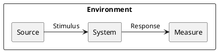

*Stimulus*: condition affecting the system

*Source*: entity generating the stimulus

*Environment*: context under which stimulus occurred (e.g., build, test, deployment, startup, normal operation, overload, failure, attack, change)

*Response*: observable result of the stimulus

*Measure*: benchmark or target value defining a successful response

Pass: 3 scenarios

Good: >3 scenarios

Exceed: >6 scenarios using challenging qualities

}

## Example Scenario

Quality: _Recoverability_

Scenario: In case of power failure, rebooting the system should take up to 20 seconds.

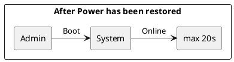

## Scenario 1
Quality: _Learnability_

Scenario: 5 minutes should be sufficient for a new user to become familiar with the platform and use it the right way.

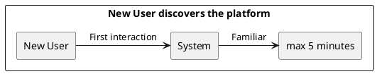

## Scenario 2
Quality: _Deployability_

Scenario: A simple push in the production branch allows to automatically deploy a new version in less than 3 minutes. 


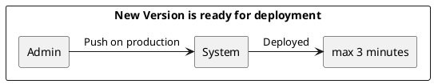

## Scenario 3
Quality: _Scalability_

Scenario: Even with bigger amount of data, the response time of the server to fetch more article data will remain constant, between 20 and 50 ms.

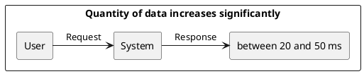

## Scenario 4
Quality: _Customizability_

Scenario: There would the possibility to specialize the system for a total different client, by changing the entries of the websites to scrape. Only one file containing the websites data would have to change.

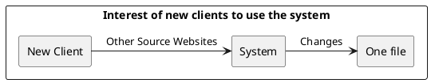

## Scenario 5
Quality: _Time to market_

Scenario: After an update, a new version, or even after the very first version, it can be given right away to the users, and we can start learning from them after a week of testing. 

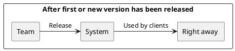

## Scenario 6
Quality: _Compatibility_

Scenario: The interface of the web platform should be sufficiently responsive to be correctly and nicely displayed on different screen sizes (large screens, tablets).

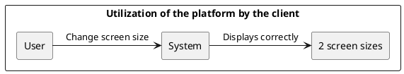

## Scenario 7
Quality: _Availability_

Scenario: The system remains available 99.9% of the time. Even in case of a failure on the scraper side (exceptionally, fails to retrieve the desired information), it remains available, and the user does not even notice the failure.


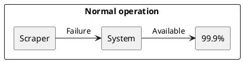

{.feedback

1-6: ok

7: Overlap between Environment and Source/Stimulus.

}
 

# Ex - Quality Attribute Tradeoff

{.instructions

Pick a free combination of two qualities on the [map](https://usi365.sharepoint.com/:x:/s/MSDE2023-SoftwareArchitecture/EbK1lRTVOUZJhQoz0XdUBwIBd5vd5yQblOaOwYze4ovbuA?e=6aexs6) and write your name to claim it.

Then write a short text giving an example for the tradeoff in this assignment.

Pass: 1 unique trade-off

Good: 2 trade-offs

Exceed: >2 trade-offs

}

## Portability vs. Performance (Example)

Developing an app natively for each OS is expensive and time consuming, but it benefits from a good performance. Choosing a cross-platform environment on the other hand simplify the development process, making it faster and cheaper, but it might suffer in performance.

## Security vs. Usability

Including a multi-authentication system allows to guarantee a better security of data privacy. But on the other hand, this adds extra steps to the authentication process, which can sometimes be annoying. For the Seismo Scraping project, as the data inside each account is not that sensible, usability has been preferred over privacy, and the authentication is a simple login with email and password.

{.feedback

"Security of Data Privacy" (Authentication is often considered part of Security and would conflict with Privacy as it removes user anonymity)

}

## Reusability vs. Performance

A reusable software component offers a great advantage, as it can be reused in other softwares, which can save time and resources in the future. But such a component might not be as performant as another one designed specifically for a single software. 

## Usability vs. Performance

A software designed for being very usable to all users, might be less performant for more expert users looking for more complexity. A perfect example is the file systems which are very usable for non-expert users, but not as efficient as the command line terminal.

# Ex - Feature Modeling

{.instructions

In the context of your chosen project domain, describe your domain using a feature model.

The feature model should be correctly visualized using the following template:


If possible, make use of all modeling constructs.

Pass: Include at least 4 non-trivial features

Good: Include at least 6 non-trivial features, which are all implemented by your project

Exceed: Include more than 8 non-trivial features, indicate which are found in your project and which belong to one competitor

}


All features are implemented in the Seismo Scraping project, apart from the session authentication (token based authentication has been chosen over session authentication), the mobile phones screen size, and the rating system on a scale from 1 to 10 (again, a star rating system has been prefered over a numerical one). Also, the personalized color theme is not implemented.


# Ex - Context Diagram

{.instructions

Prepare a context diagram to define the design boundary for your project.

Here is a PlantUML/C4 example to get started.


Make sure to include all possible user personas and external dependencies you may need.

Pass: 1 User and 1 Dependency

Good: >1 User and >1 Dependency

Exceed: >1 User and >1 Dependency, with both incoming and outgoing dependencies

}


# Ex - Component Model: Top-Down

{.instructions

Within the context of your project domain, represent a model of your modular software architecture decomposed into components.

The number of components in your logical view should be between 6 and 9:

- At least one component should be further decomposed into sub components
- At least one component should already exist. You should plan how to reuse it, by locating it in some software repository and including in your model the exact link to its specification and its price.
- At least one component should be stateful.

The logical view should represent provide/require dependencies that are consistent with the interactions represented in the process view.

The process view should illustrate how the proposed decomposition is used to satisfy the main use case given by your domain model.

You can add additional process views showing how other use cases can be satisfied by the same set of components.

This assignment will focus on modularity-related decisions, we will worry about deployment and the container view later.

Here is a PlantUML example logical view and process view.

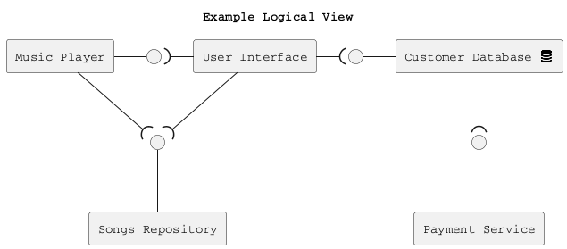

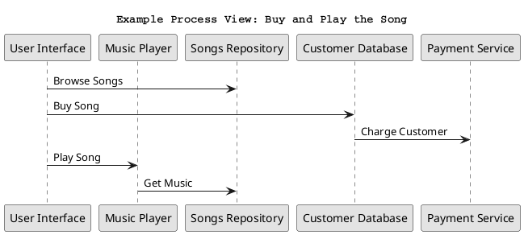

Hint: How to connect sub-components to other external components? Use this pattern.

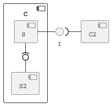

Pass: 6 components (1 decomposed), 1 use case/process view

Good: 6 components (1 decomposed), 2 use case/process view

Exceed: >6 components (>1 decomposed) and >2 use case/process view

}

## Logical View
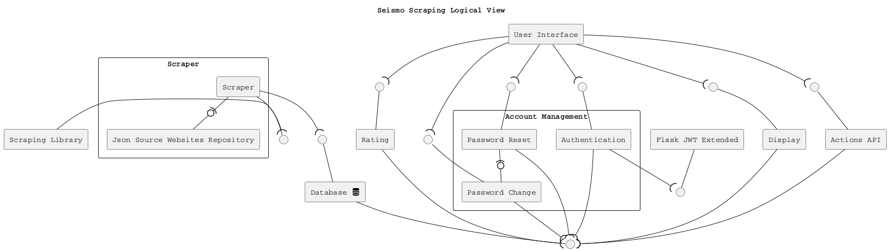


## Process Views

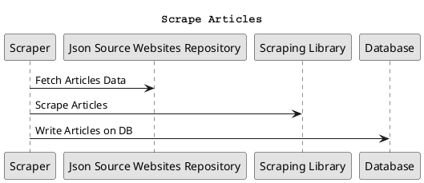

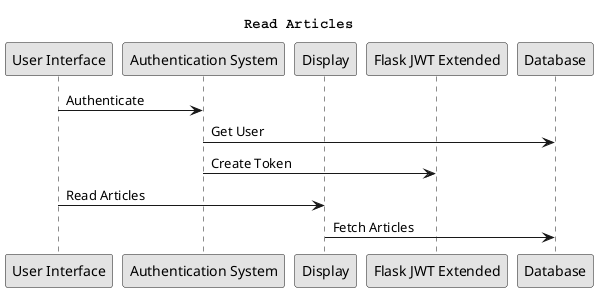

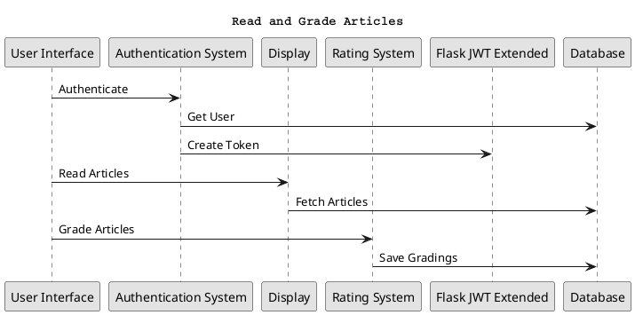

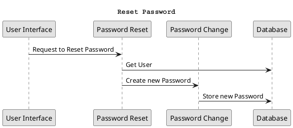

# Ex - Component Model: Bottom-Up

{.instructions

Within the context of your project domain, represent a model of your modular software architecture decomposed into components.

To design this model you should attempt to buy and reuse as many components as possible.

In addition to the logical and process views, you should give a precise list to all sources and prices of the components you have selected to be reused.

Write an ADR to document your component selection process (indicating which alternatives were considered).

Pass: Existing design with at least 1 reused components (1 Logical View, 1 Process View)

Good: Existing design with at least 3 reused components (1 Logical View, 1 Process View, 1 ADR)

Exceed: Redesign based on >3 reused components (1 Logical View, >1 Process View, >1 ADR)

}

## Logical View
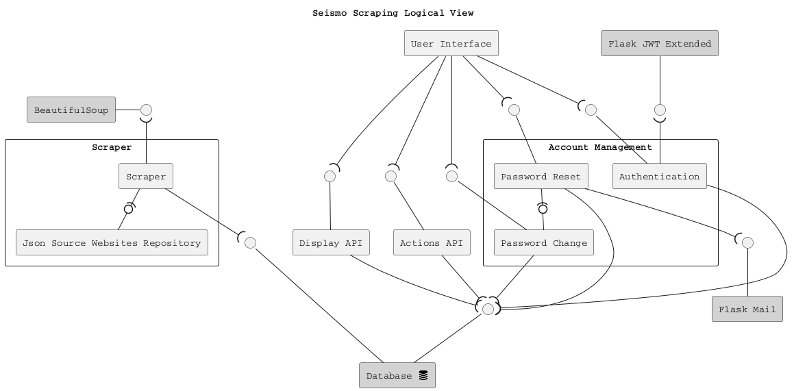

BeautifulSoup4 : https://pypi.org/project/beautifulsoup4/
Flask-Mail : https://pypi.org/project/Flask-Mail/
Flask-JWT-Extended: https://pypi.org/project/Flask-JWT-Extended/
MySQL Database: https://www.mysql.com/downloads/


## Process Views
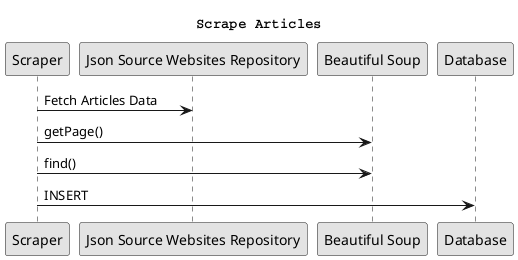

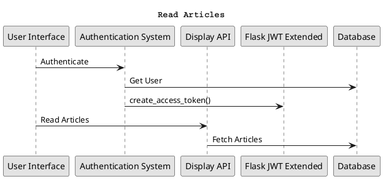

## ADR


# Ex - Interface/API Specification

{.instructions

In this iteration, we will detail your previous model to specify the provided interface of all components based on their interactions found in your existing process views.

1. choose whether to use the top down or bottom up model. If you specify the interfaces of the bottom up model, your interface descriptions should match what the components you reuse already offer.

2. decide which interface elements are operations, properties, or events.

Get started with one of these PlantUML templates, or you can come up with your own notation to describe the interfaces, as long as it includes all the necessary details.

The first template describes separately the provided/required interfaces of each component. 


The second template annotates the logical view with the interface descriptions: less redundant, but needs the logical dependencies to be modeled to show which are the required interfaces.


Pass: define interfaces of all outer-level components

Good: Define interfaces of all outer-level components. Does your architecture publish a Web API? If not, extend it so that it does. 

Exceed: Also, document the Web API using the OpenAPI language. You can use the [OpenAPI-to-Tree](http://api-ace.inf.usi.ch/openapi-to-tree/) tool to visualize the structure of your OpenAPI description.

}

```puml
@startuml
skinparam componentStyle rectangle

!include <tupadr3/font-awesome/database>

title Seismo Scraping Logical View with Interface/API Specification

interface " " as BSP
interface " " as FJWT
interface " " as UAS
interface " " as SDB
interface " " as UIP
interface " " as UIC
interface " " as DBI
interface " " as UID
interface " " as UIA
interface " " as FMI


[BeautifulSoup] as BS #lightgray
[Database <$database{scale=0.33}>] as DB #lightgray
[User Interface] as UI
[Flask JWT Extended] as JWT #lightgray
[Display API] as D
[Actions API] as AA
[Flask Mail] as FM #lightgray


component Scraper as SM {
   component Scraper as M
   component "Json Source Websites Repository" as Json
   M -(0- Json
}

component "Account Management" as PM {
  component "Authentication" as AS
  component "Password Change" as PC
  component "Password Reset" as PR
  PR -(0- PC
}

FMI -- FM
UID -- D
UIA -- AA
BS - BSP
DB -up- DBI
UAS -- AS
SDB --- DB
M -up-( BSP
M --( SDB
JWT -- FJWT
AS -up-( FJWT
UI --( UAS
AS --( DBI
UIP -- PR
UIC -- PC
PR --( DBI
PC --( DBI
UI --( UIP
UI --( UIC
D --( DBI
AA --( DBI
UI --( UID
UI --( UIA
PR --( FMI


note top of BSP
operation:
..
find()
find_all()
end note

note top of FJWT
operation:
..
create_access_token()
decode_token()
unset_jwt_cookies()
jwt_required()
end note

note right of FMI
operation:
..
send(msg)
end note

note top of SDB
operation:
..
INSERT into article (article)
end note

note bottom of DBI
operations:
..
query(Table)
end note

note top of UID
endpoints:
..
GET /recent_articles
GET /all_articles
GET /trash_articles
GET /articles/<id>
GET /keywords
end note

note top of UIA
endpoints:
..
PUT /keywords/<id>
POST /keywords
DELETE /keywords/<id>
PUT /gradings/<id>
POST /grading-actions
end note

note top of UIC
endpoints:
..
POST /change_password
end note

note top of UIP
endpoints:
..
POST /forget
POST /reset
end note

note top of UAS
endpoints:
..
POST /login
end note

skinparam monochrome true
skinparam shadowing false
skinparam defaultFontName Courier
@enduml
```

# Ex - Connector View

{.instructions

Extend your existing models introducing the connector view

For every pair of connected components (logical view), pick the most suitable connector. Existing components can play the role of connector, or new connectors may need to be introduced.


Make sure that the interactions shown in the process views reflect the primitives of the selected connector

Pass: model existing connectors based on previous model decisions

Good: model existing connectors based on previous model decisions, write an ADR about the choice of one connector

Exceed: introduce a new type of connector and update your existing process view 
(sequence diagram) to show the connector primitives in action

}

# Ex - Adapters and Coupling

{.instructions

1. Highlight the connectors (or components) in your existing bottom-up design playing the role of adapter. (We suggest to use the bottom-up design since when dealing with externally sourced components, their interfaces can be a source of mismatches).
2. Which kind of mismatch** are they solving?
3. Introduce a wrapper in your architecture to hide one of the previously highlighted adapters
4. Where would standard interfaces play a role in your architecture? Which standards could be relevant in your domain?
5. Explain how one or more pairs of components are coupled according to different coupling facets
6. Provide more details on how each adapter solves the mismatches identified using pseudo-code or the actual code
7. How can you improve your architectural model to minimize coupling between components? (Include a revised logical/connector view with your solution)

Pass: 1-5 (with one adapter)

Good: 1-6 (with at least two adapters)

Exceed: 1-7 (with at least two adapters)

** If you do not find any mismatch in your existing design we suggest to introduce one artificially.

## Hints

* (1) Should we find cases where two components cannot communicate (and are doing it wrongly) and highlight they would need an adapter?, or cases where we have already a "component playing the role of adapter in the view" and highlight only the adapter?

  *Both are fine. We assumed that if you draw a dependency (or a connector) the interfaces match, but if you detect that the components that should communicate cannot communicate then of course introduce an adapter to solve the mismatch*

* (2) Please show the details about the two interfaces which do not match (e.g., names of parameters, object structures) so that it becomes clear why an adapter is needed and what the adapter should do to bridge the mismatch

* (5-6) These questions are about the implications on coupling based on the decisions you documented in the connector view.
Whenever you have a connector you couple together the components and different connectors will have different forms of coupling

  For example, if you use calls everywhere, do you really need them everywhere? is there some pair of components where you could use a message queue instead?

  Regarding the coupling facets mentioned in question 5. You do not have to answer all questions related to "discovery", "session", "binding", "interaction", "timing", "interface" and "platform" (p.441, Coupling Facets). Just the ones that you think are relevant for your design and by answering them you can get ideas on how to do question 6.

}


# Ex - Physical and Deployment Views

{.instructions

a. Extend your architectural model with the following viewpoints:

1. Physical or Container View

2. Deployment View

Your model should be non-trivial: include more than one physical device/virtual container (or both). Be ready to discuss which connectors are found at the device/container boundaries.

b. Write an ADR about which deployment strategy you plan to adopt. The alternatives to be considered are: big bang, blue/green, shadow, pilot, gradual phase-in, canary, A/B testing.

c. (Optional) Prepare a demo of a basic continuous integration and delivery pipeline for your architectural documentation so that you can obtain a single, integrated PDF with all the viewpoints you have modeled so far. 

For example:

- configure a GitHub webhook to be called whenever you push changes to your documentation
- setup a GitHub action (or similar) to build and publish your documentation on a website

Pass: 1 physical view, 1 deployment view, 1 ADR (b.)

Good: >1 physical view, >1 deployment view, 1 ADR (b.)

Exceed: 1 physical view, 1 deployment view, 1 ADR (b.) + 1 demo (c.)

}

# Ex - Availability and Services

{.instructions 

The goal of this week is to plan how to deliver your software as a service with high availability.

1. If necessary, change your deployment design so that your software is hosted on a server (which could be running as a Cloud VM). Your SaaS architecture should show how your SaaS can be remotely accessed from a client such as a Web browser, or a mobile app
2. Sketch your software as a service pricing model (optional)
3. How would you define the availability requirements in your project domain? For example, what would be your expectation for the duration of planned/unplanned downtimes or the longest response time tolerated by your clients?
4. Which strategy do you adopt to monitor your service's availability? Extend your architecture with a watchdog or a heartbeat monitor and motivate your choice with an ADR.
5. What happens when a stateless component goes down? model a sequence diagram to show what needs to happen to recover one of your critical stateless components
6. How do you plan to recover stateful components? write an ADR about your choice of replication strategy and whether you prefer consistency vs. availability. Also, consider whether event sourcing would help in your context.
7. How do you plan to avoid cascading failures? Be ready to discuss how the connectors (modeled in your connector view) impact the reliability of your architecture.
8. How did you mitigate the impact of your external dependencies being not available? (if applicable)

Pass: 1, 3, 4, one of:  5, 6, 7, 8

Good: 1, 2, 3, 4, two of:  5, 6, 7, 8

Exceed: 1, 2, 3, 4, 5, 6, 7, 8

}

# Ex - Flexibility

{.instructions 

Only dead software stops changing. You just received a message from your customer, they have an idea. Is your architecture ready for it?

1. Pick a new use case scenario. Precisely, what exactly do you need to change of your existing architecture so that it can be supported? Model the updated logical/process/deployment views.

2. Pick another use case scenario so that it can be supported without any major architectural change (i.e., while you cannot add new components, it is possible to extend the interface of existing ones or introduce new dependencies). Illustrate with a process view, how your previous design can satisfy the new requirement.

3. Change impact. One of your externally sourced component/Web service API has announced it will introduce a breaking change. What is the impact of such change? How can you control and limit the impact of such change? Update your logical view

4. Open up your architecture so that it can be extended with plugins by its end-users. Where would be a good extension point? Update your logical view and give at least one example of what a plugin would actually do.

5. Assuming you have a centralized deployment with all stateful components storing their state in the same database, propose a strategy to split the monolith into at least two different microservices. Model the new logical/deployment view as well as the interfaces of each microservice you introduce.

Pass: 1, one out of 2-5.

Good: 1, two out of 2-5.

Exceed: 1-5.

}